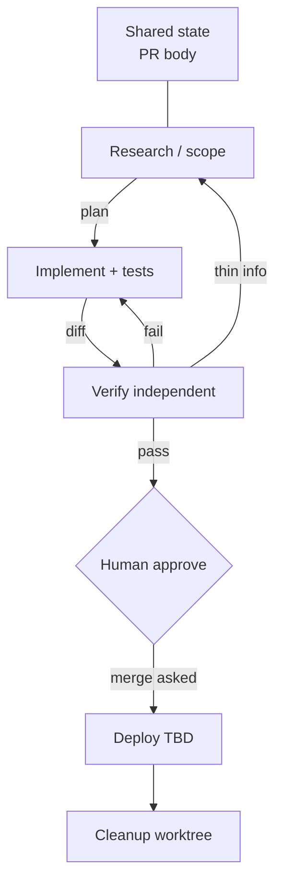

# Agent PR graph

Explicit graph for non-trivial fix/feature work. Typo / single-file obvious fixes stay a single loop.

This is harness documentation, not a runtime. Shared state lives in the PR body (and optional `PROGRESS.md` in a worktree).

## When to use the full graph

Use when **at least three** apply:

1. Work spans multiple layers or surfaces
2. Real branch/rollback paths exist
3. Intermediate state is worth checkpointing
4. Done-ness is checkable (commands, CI, reviewer verdicts)
5. Coordination benefit beats overhead (especially `child_data: yes`)

Otherwise: implement → verify → done.

## Shared state

```text
acceptance: <1–3 observable outcomes>
layers: none | web | mobile | api
child_data: yes | no
ui_screenshots: yes | n/a
verify: <commands + exit codes / reviewer verdicts>
risks: <privacy, auth, rollback>
```

## Nodes and routing



| Node | Type | Job |
|------|------|-----|
| Research / scope | agent | Locate code, scope-challenge, reuse first |
| Implement | agent | Write code/tests; local verify while iterating |
| Verify | fresh agent | `/verifier` (+ `/security-auditor`, `/ui-reviewer` as needed) without implementer rationale |
| Human approve | Tam | Merge only on explicit ask; `[ready]` ≠ merge |
| Deploy | TBD | Note status until a deploy path exists |
| Cleanup | deterministic | Remove worktree after merge |

### Routing

| From | Condition | Next |
|------|-----------|------|
| Verify | fail / checklist miss | Implement |
| Verify | acceptance unclear | Research |
| Verify | pass + screenshots if UI + CI green | Human (`[ready]`) |
| Human | Tam asks to merge | Deploy TBD → Cleanup |
| Any | new push after `[ready]` | strip `[ready]`, back to Verify |

## Independent verify (critical)

For `child_data: yes`, auth, or storage changes, verify must be independent of the implementer's session.

### Child-data checklist

- [ ] Minimal PII collected; purpose clear
- [ ] No kids data in logs/analytics by default
- [ ] Parent/guardian gates considered where needed
- [ ] Secrets not committed; env-based config

### Anti-Goodhart

`[ready]` and green CI optimize for "looks mergeable." Anchors that must not drift:

- Child privacy and safety
- No self-approval by the builder
- Screenshots present when UI changed

## Related

- `AGENTS.md`
- `.cursor/skills/pr-workflow/SKILL.md`
- `.cursor/agents/verifier.md`, `security-auditor.md`, `ui-reviewer.md`
